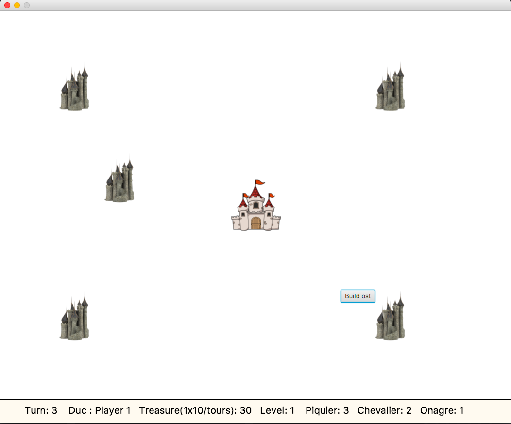

# Dukes of the Realm - Jeux de stratégie

Le jeu se déroule dans un royaume lointain, à la stabilité discutable,dans lequel le trône a été laissé vacant suite à diverses intrigues qu’il ne nous appartient pas de décrire ici. Chaque joueur incarne un duc, en lutte pour devenir le nouveau roi. Pour cela, ils doivent vassaliser les autres en conquérant leur terres.

Les joueurs disposent de châteaux générant des richesses avec lesquels ils pourront lever des osts pour attaquer les châteaux adverses. Le jeu se termine dès qu’un seul duc possède encore au moins un château.

## Introduction

### Prérequis

* Nécessite JDK : Java11+ https://openjfx.io

* IDE utilisé : Eclipse 

* Système d'exploitation MacOS : Il faut installer un software dans Eclipse permettant de créer des projets JavaFX. Plusieurs tutoriels sont disponibles sur internet en fonctions des versions.

`Help -> Install New Software -> e(fx)clipse -> Next -> Install`

* Pour lancer le programme il faut compiler le programme Main.java sous Eclipse

`Main.java -> Run as -> Java Application`

## Version de base 

### Déroulement du jeu : 

* Le royaume contient :
    - un château d'origine par duc;
    - un ensemble de châteaux neutres (appartenant à des barons sans ambition);
    - des zones "libres" (i.e. la campagne).

* Un château contient :
    - un duc propriétaire; 
    - un trésor (en florins);
    - un niveau (qui impacte le revenu);
    - une réserve de troupes;
    - une possibilité de produire des troupes;
    - un ordre de déplacement courant (une cible et un nombre de troupes à envoyer);
    - une porte (située au milieu de l’un des quatres côtés).

* Le niveau X d’un château coûte 1000*X florins. Le revenu d’un château est son niveau*10 florins/tours.

* Si le château a un ordre de déplacement, il envoie au maximum trois troupes par sa porte.

* À chaque tour, un soldat sur le terrain progresse de sa vitesse vers sa cible. Il n’évitera pas les autres soldats (et ne se battra pas contre eux).

* Lorsqu’un soldat atteint sa cible : Le compteur de réserve ennemie se décremente en fonction de chaque type de soldats qui attaque.

#### Le tableau des troupes avec leurs caractéristiques est le suivant :

|               | coût de prod.| temps de prod. (en tours) | vitesse (case/tour)| points de vie | dommages |
| -------------:|   :-------------:                     | :-----:      | :-----:                   | :----:             | :----:        |  :----:  |
| **Piquier**   |    100       |       5                   |        2           |       1       |    1     |
| **Chevalier** |    500       |      20                   |        4           |       3       |    5     |
| **Onagre**    |    1000      |       50                  |        1           |       5       |    10    |

### Interactions avec le jeu :

* Clique droit sur un joueur permet de créer de nouvelles unités ou bien ou d'augmenter de niveau.

* Clique droit sur un ennemie permet de diriger une attaque.

* Clique gauche sur les chateaux permet de voir : la richesse, la reserve de troupes, le propriétaire, le niveau.

* L'appui sur la touche p permet de mettre le jeu en pause et l'appui sur la touche u permet d'enlever la pause.

### Problèmes rencontrés :

* Temps de production en fonction du nombres de tour.

* Lors de l'attaque des soldats la réserve ennemie peut être inférieure à 0. Il faut que chaque type de soldats soit égal à 0 pour que le château appartienne au duc attaquant.

* L'intelligence artificielle des ennemies à posés problème. Lorsque nous avons implémenter l'IA ennemie plusieurs problèmes sont survenus tels que l'apparition d'images, le spawn des troupes, le mouvements des images.

* Nous avons un problèmes avec la production des unités, lors du temps de productions le jeux s'arrête. 

## Choix et remarques d'implémentation :
### Remarques sur le rôle des classes :

#### [Main](src_basic/SampleGame/Main.java)
* S'occupe de toutes les intéractions utilisateurs et s'occupe de mettre en place l'interface
* Contient également plusieurs fonctions utiles pour le déroulement du jeu (qu'on aurait surement pu mettre dans une classe Utils.java)
* La boucle du jeu tourne également dans le Main

#### [Castle](src_basic/SampleGame/Castle.java)
* Cette classe nous sert à créer les différents châteaux ennemies au lancement de la partie contenant une réserve de troupes initial.

#### [Units](src_basic/SampleGame/Units.java)
* Classe qui hérite de Sprite, utile pour implémenter nos différents types d'unités. On à rajouter quelques attributs (vitesse, temps de production...).
* Contient notre fonction de mouvement qui nous permet de faire bouger nos différentes images jusqu'au château ennemie.

#### [Input](src_basic/SampleGame/Input.java)
* Contient ce qui est nécessaire pour l'intéraction utilisateur tels que le handler d'evenement et les listeners.

#### [Sprite](src_basic/SampleGame/Sprite.java)
* Classe mère de Castle,Units et Player. Permet de factoriser du code pour ne pas avoir à implémenter les attributes et méthodes nécessaires dans chaque classe (exemple: vie, dégat, x, y...)
* C'est dans cette classe que nous aurons nos principaux attributs/méthodes permettant le fonctionnement du jeu.

#### [Settings](src_basic/SampleGame/Settings.java)
* Contient toutes les variables que nous ne devons pas modifier tels que les paramètres de chaque unités, la taille de l'écran, le nombre d'ennemies...

#### [Player](src_basic/SampleGame/Player.java)
* Classe permettant de créer le joueur ayant un niveau, une liste de troupes initial, et des listes de troupes de types Units.

## Bibliothèque graphique
* Le projet est réaliser avec la bibliothèque graphique JavaFX. 

## Ameliorations envisageable
* Amélioration du château du joueur en fonction d'un certains nombre de tours.
* Creation de châteaux neutres au lancement de la partie.
* Lorsqu'un soldat atteint sa sible si le château et le soldat appartiennent au même joueur, le soldat rejoins la réserve du château.
* Intelligence artificielle ennemie.

